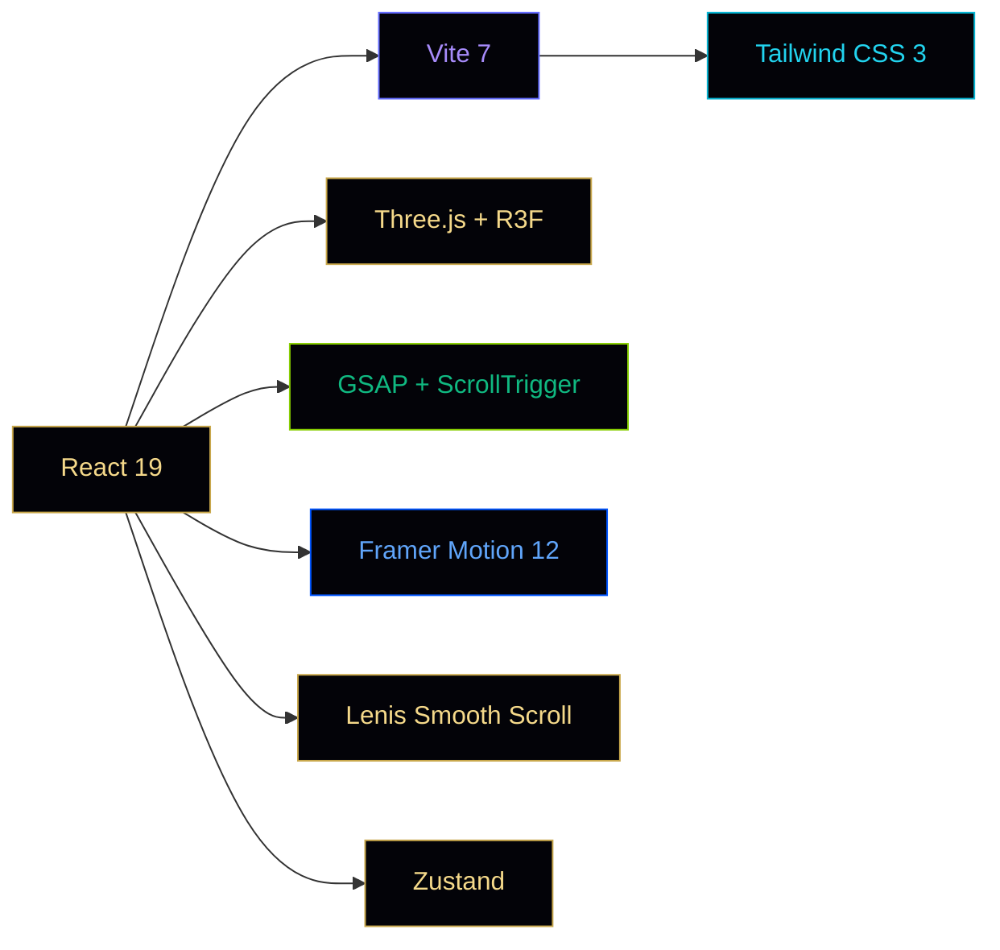

<div align="center">

<!-- Animated SVG Header -->


<br/>

<!-- Animated typing -->
<a href="#">
  
</a>

<br/><br/>

<!-- Badges Row 1 — Status -->


<br/>

<!-- Badges Row 2 — Tech -->


</div>

---

<div align="center">
  
</div>

##  About

**Chronos Agency** is an award-quality cinematic web experience that takes visitors on a journey through time — from 10,000 BC to the digital present. Built with the philosophy that the web should feel like cinema, every pixel is intentional, every scroll is a story beat, and every interaction is choreographed.

> *"The future belongs to those who believe in the beauty of their code."*

<br/>

<div align="center">

```
╔══════════════════════════════════════════════════════════════╗
║                                                              ║
║     10,000 BC  ──→  3,000 BC  ──→  1500 AD  ──→  1880 AD   ║
║         │              │              │              │       ║
║       Dawn        Monuments      Renaissance     Industry    ║
║                                                              ║
║                    ──→  PRESENT  ──→  ∞                      ║
║                          │                                   ║
║                     Digital Age                              ║
║                                                              ║
╚══════════════════════════════════════════════════════════════╝
```

</div>

---

##  Features

<table>
<tr>
<td width="50%">

### 🎬 Cinematic Preloader
SVG ring progress with rotating clock hand, gold gradient branding, and circular clip-path exit animation.

### ✨ Magnetic Particle Cursor  
Canvas-based particle trail system with outer ring + inner dot, magnetic response to interactive elements.

### 📜 Apple-Style Scroll Reveal  
Word-by-word opacity reveal driven by ScrollTrigger scrub — inspired by Apple's product pages.

</td>
<td width="50%">

### 🌀 3D Background Scene  
Real-time Three.js scene with rotating wireframe wormhole, distorted pyramid, and starfield.

### ↔️ Horizontal Gallery  
GSAP-pinned horizontal scroll with progress bar, counter display, and parallax card entries.

### 🕐 Scroll Timeline Nav  
Fixed right-side vertical nav with 7 era dots, colored progress track, and click-to-scroll.

</td>
</tr>
</table>

<details>
<summary><b>🔥 More Premium Features (click to expand)</b></summary>
<br/>

| Feature | Description |
|---------|-------------|
| 🎭 **Split Character Animation** | Hero text reveals character by character with `y:120, rotateX:-90` stagger |
| 🖼️ **Multi-Layer Parallax** | 3 depth layers per era section with independent scroll speeds |
| 📸 **Clip-Path Image Reveals** | Images materialize with `inset()` clip animations on scroll |
| 🏗️ **Asymmetric Grid Layouts** | 12-column CSS Grid with editorial magazine-style compositions |
| 🎨 **Grayscale-to-Color Hover** | Industrial era images transition from monochrome on hover |
| ⚙️ **Skewed Data Cards** | CSS transforms create mechanical/industrial aesthetic |
| 🌈 **Gradient Orb Parallax** | Radial gradient orbs float at different parallax speeds |
| 🎞️ **Film Grain Overlay** | SVG turbulence noise filter with stepped keyframe animation |
| 📊 **Animated Counter Stats** | GSAP-driven number counting triggered on scroll into view |
| 🧲 **Magnetic Links** | Footer links respond to mouse proximity with elastic spring-back |
| 🔔 **Newsletter CTA** | Rounded pill-style email input with golden gradient submit button |
| ⬆️ **Smart Back-to-Top** | "Back to Origin" button with scroll-to-top and hover arrow animation |

</details>

---

##  Tech Stack

<div align="center">



</div>

| Technology | Purpose | Version |
|:---:|:---:|:---:|
|  | UI Framework | `19.2.4` |
|  | 3D Rendering | `0.182` |
|  | Scroll Animations | `3.14.2` |
|  | Component Animations | `12.34.1` |
|  | Styling | `3.4.17` |
|  | Build Tool | `7.3.1` |
|  | Smooth Scroll | `1.3.17` |
|  | State Management | `5.0.11` |

---

## 🏗️ Architecture

```
chronos-agency/
├── src/
│   ├── App.jsx                    # Root — orchestrates preloader, cursor, content
│   ├── main.jsx                   # React 19 createRoot entry
│   ├── index.css                  # Global styles, film grain, gradients
│   │
│   ├── sections/                  # Page sections (scroll order)
│   │   ├── Hero.jsx               # Split-char animation, live clock, parallax
│   │   ├── VideoIntro.jsx         # "Through The Ages" — scroll reveals + images
│   │   ├── HorizontalGallery.jsx  # GSAP-pinned horizontal scroll gallery
│   │   ├── Era1.jsx               # Ancient Era — multi-layer parallax
│   │   ├── Era2.jsx               # Industrial — asymmetric grid, grayscale
│   │   ├── TransitionBridge.jsx   # Past→Present timeline bridge
│   │   ├── Era3.jsx               # The Present — orbs, feature cards
│   │   └── Footer.jsx             # Premium footer w/ magnetic links
│   │
│   ├── components/
│   │   ├── canvas/                # Three.js 3D elements
│   │   │   ├── Scene.jsx          # R3F Canvas + lights
│   │   │   ├── Wormhole.jsx       # Rotating wireframe cylinder
│   │   │   └── Pyramid.jsx        # Distorted gold cone
│   │   │
│   │   ├── ui/                    # Reusable UI components
│   │   │   ├── Preloader.jsx      # Cinematic loading sequence
│   │   │   ├── MagneticCursor.jsx # Canvas particle trail cursor
│   │   │   ├── ScrollTimeline.jsx # Fixed vertical scroll nav
│   │   │   ├── ScrollTextReveal.jsx # Word-by-word opacity reveal
│   │   │   ├── SectionReveal.jsx  # Circular clip-path mask
│   │   │   ├── CustomCursor.jsx   # Legacy cursor (replaced)
│   │   │   ├── WarpButton.jsx     # Gold hover-slide button
│   │   │   └── Carousel360.jsx    # 3D CSS perspective carousel
│   │   │
│   │   └── layout/
│   │       └── SmoothScroll.jsx   # Lenis wrapper + Zustand
│   │
│   └── store/
│       └── useStore.js            # Zustand: era, scrollProgress
│
├── index.html                     # Google Fonts preconnect
├── tailwind.config.js             # Extended palette + animations
├── vite.config.js                 # Vite + React plugin
├── postcss.config.js              # PostCSS + Tailwind + Autoprefixer
└── package.json                   # Dependencies
```

---

## 🚀 Quick Start

<details>
<summary><b>Prerequisites</b></summary>

- **Node.js** ≥ 18.0
- **npm** ≥ 9.0 or **yarn** ≥ 1.22

</details>

```bash
# Clone the repository
git clone https://github.com/yourusername/chronos-agency.git

# Navigate to project
cd chronos-agency

# Install dependencies
npm install

# Start development server
npm run dev
```

> The dev server starts at `http://localhost:5173` with Hot Module Replacement.

### Build for Production

```bash
# Optimized production build
npm run build

# Preview build locally
npm run preview
```

---

## 🎨 Color System

<div align="center">

| Swatch | Name | Hex | Usage |
|:---:|:---|:---:|:---|
|  | **Gold** | `#c9a84c` | Primary brand, Ancient era |
|  | **Gold Light** | `#f5d98a` | Highlights, gradients |
|  | **Purple** | `#a78bfa` | Transitions, bridge era |
|  | **Cyan** | `#22d3ee` | Present/future era |
|  | **Rose** | `#fb7185` | Accents, CTA |
|  | **Emerald** | `#10b981` | Status, success |
|  | **Deep Black** | `#030308` | Background base |

</div>

---

## 📐 Design Principles

<div align="center">

```
┌─────────────────────────────────────────────────────┐
│                                                     │
│   1. CINEMA FIRST                                   │
│      Every scroll is a story beat                   │
│                                                     │
│   2. LESS IS MORE                                   │
│      White space is a design element                │
│                                                     │
│   3. MOTION WITH PURPOSE                            │
│      No animation without narrative reason          │
│                                                     │
│   4. PROGRESSIVE DISCLOSURE                         │
│      Reveal complexity through interaction          │
│                                                     │
│   5. PERFORMANCE OBSESSION                          │
│      60fps or nothing — will-change, GPU composites │
│                                                     │
└─────────────────────────────────────────────────────┘
```

</div>

---

## ⚡ Performance

| Metric | Target | Implementation |
|:---|:---:|:---|
| First Contentful Paint | < 1.5s | Vite code splitting, font preconnect |
| Scroll FPS | 60fps | GSAP `scrub`, `will-change`, GPU compositing |
| 3D Scene | < 5ms/frame | Low-poly geometry, instanced lights |
| Bundle Size | < 500KB gz | Tree-shaking, lazy loading |
| Lighthouse Score | > 90 | Semantic HTML, image `loading="lazy"` |

---

## 🙏 Acknowledgments

- [GSAP](https://greensock.com/) — The gold standard of web animation
- [Three.js](https://threejs.org/) — Making the web three-dimensional
- [Lenis](https://lenis.studiofreight.com/) — Buttery smooth scrolling
- [Unsplash](https://unsplash.com/) — Breathtaking imagery
- Inspired by [Apple](https://apple.com), [Awwwards](https://awwwards.com), and studios pushing the web

---

## 📄 License

This project is licensed under the **MIT License** — see the [LICENSE](LICENSE) file for details.

---

<div align="center">


<br/>

**Built with obsession by Chronos Agency**

<a href="#">
  
</a>

<br/>

⭐ **Star this repo if it stopped your scroll** ⭐

<br/>


</div>
